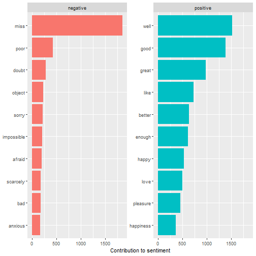
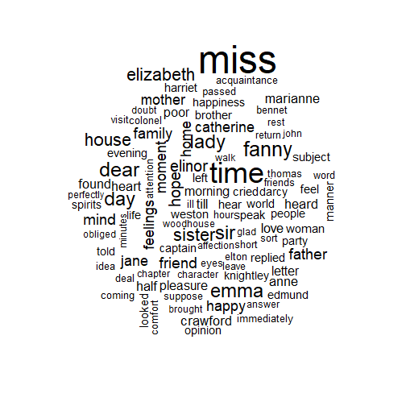
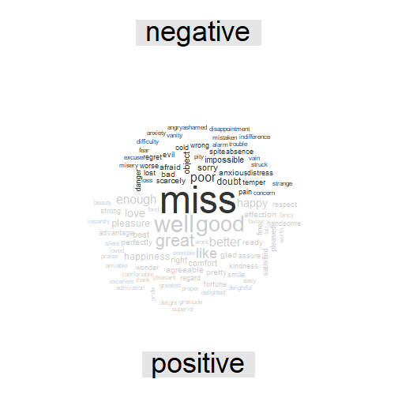
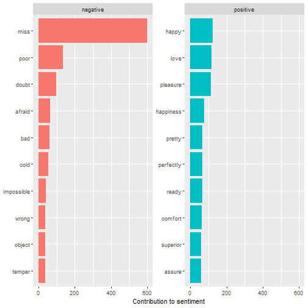
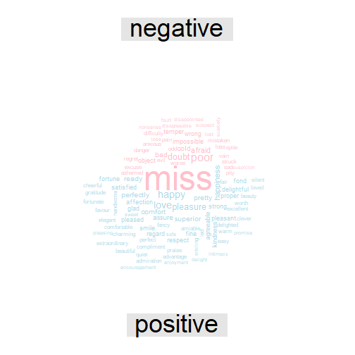
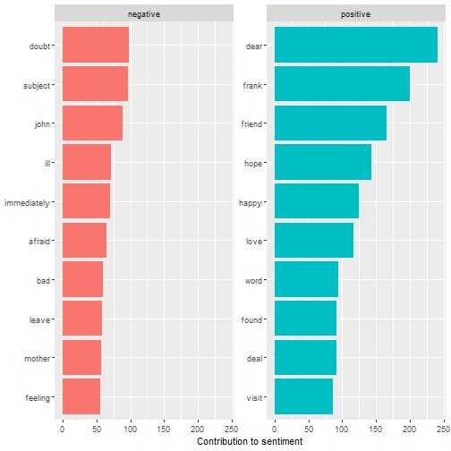
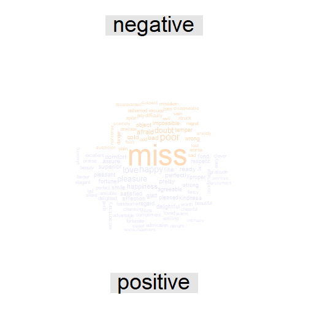

Sentiment Analysis


## Requirements


``` r
library(tidyverse)
library(stringr)
library(rvest)
library(dplyr)
library(tidytext)
library(textdata)
library(ggplot2)
library(wordcloud)
library(reshape2)
library(topicmodels)
library(janeaustenr)
```

## Sentiment Lexicons
### AFINN: With Scores e.g.) -5, -4, -3, ..., 3, 4, 5


``` r
get_sentiments("afinn") 
```

```
## # A tibble: 2,477 × 2
##    word       value
##    <chr>      <dbl>
##  1 abandon       -2
##  2 abandoned     -2
##  3 abandons      -2
##  4 abducted      -2
##  5 abduction     -2
##  6 abductions    -2
##  7 abhor         -3
##  8 abhorred      -3
##  9 abhorrent     -3
## 10 abhors        -3
## # ℹ 2,467 more rows
```

### Bing: Positive or Negative


``` r
get_sentiments("bing")
```

```
## # A tibble: 6,786 × 2
##    word        sentiment
##    <chr>       <chr>    
##  1 2-faces     negative 
##  2 abnormal    negative 
##  3 abolish     negative 
##  4 abominable  negative 
##  5 abominably  negative 
##  6 abominate   negative 
##  7 abomination negative 
##  8 abort       negative 
##  9 aborted     negative 
## 10 aborts      negative 
## # ℹ 6,776 more rows
```

### NRC: Various Sentiments such as Trust, Fear, Sadness, etc.


``` r
textdata::lexicon_nrc()
```

```
## # A tibble: 13,872 × 2
##    word        sentiment
##    <chr>       <chr>    
##  1 abacus      trust    
##  2 abandon     fear     
##  3 abandon     negative 
##  4 abandon     sadness  
##  5 abandoned   anger    
##  6 abandoned   fear     
##  7 abandoned   negative 
##  8 abandoned   sadness  
##  9 abandonment anger    
## 10 abandonment fear     
## # ℹ 13,862 more rows
```

#### Extracting Negative Words Only in NRC


``` r
nrc <- get_sentiments("nrc") %>% filter(word=="negative")
```

## Text Preprocessing


``` r
tidy_books <- austen_books() %>%
  group_by(book) %>%
  mutate(
    linenumber = row_number(),
    chapter = cumsum(str_detect(text, 
                                regex("^chapter [\\divxlc]", 
                                      ignore_case = TRUE)))) %>%
  ungroup() %>% unnest_tokens(word, text)

tidy_books
```

```
## # A tibble: 725,055 × 4
##    book                linenumber chapter word       
##    <fct>                    <int>   <int> <chr>      
##  1 Sense & Sensibility          1       0 sense      
##  2 Sense & Sensibility          1       0 and        
##  3 Sense & Sensibility          1       0 sensibility
##  4 Sense & Sensibility          3       0 by         
##  5 Sense & Sensibility          3       0 jane       
##  6 Sense & Sensibility          3       0 austen     
##  7 Sense & Sensibility          5       0 1811       
##  8 Sense & Sensibility         10       1 chapter    
##  9 Sense & Sensibility         10       1 1          
## 10 Sense & Sensibility         13       1 the        
## # ℹ 725,045 more rows
```

## Sentiment Analysis
### Sentiment Analysis with NRC Lexicon
#### `filter()` for the Joy Words with NRC Lexcicon 


``` r
nrc_joy <- get_sentiments("nrc") %>% 
  filter(sentiment == "joy")
```

#### `inner_join()` to find most common joy words in Emma  


``` r
tidy_books %>%
  filter(book == "Emma") %>%
  inner_join(nrc_joy) %>%
  count(word, sort = TRUE)
```

```
## Joining with `by = join_by(word)`
```

```
## # A tibble: 301 × 2
##    word          n
##    <chr>     <int>
##  1 good        359
##  2 friend      166
##  3 hope        143
##  4 happy       125
##  5 love        117
##  6 deal         92
##  7 found        92
##  8 present      89
##  9 kind         82
## 10 happiness    76
## # ℹ 291 more rows
```

### Sentiment Analysis with Bing Lexicon
#### Analyzing Word Counts That Contribute to Each Sentiment 


``` r
bing_word_counts <- tidy_books %>%
  inner_join(get_sentiments("bing")) %>%
  count(word, sentiment, sort = TRUE) %>%
  ungroup()
```

```
## Joining with `by = join_by(word)`
```

```
## Warning in inner_join(., get_sentiments("bing")): Detected an unexpected many-to-many relationship between `x` and `y`.
## ℹ Row 435434 of `x` matches multiple rows in `y`.
## ℹ Row 5051 of `y` matches multiple rows in `x`.
## ℹ If a many-to-many relationship is expected, set `relationship = "many-to-many"` to silence
##   this warning.
```

``` r
bing_word_counts
```

```
## # A tibble: 2,585 × 3
##    word     sentiment     n
##    <chr>    <chr>     <int>
##  1 miss     negative   1855
##  2 well     positive   1523
##  3 good     positive   1380
##  4 great    positive    981
##  5 like     positive    725
##  6 better   positive    639
##  7 enough   positive    613
##  8 happy    positive    534
##  9 love     positive    495
## 10 pleasure positive    462
## # ℹ 2,575 more rows
```

## Visualization:
### Bar Chart


``` r
bing_word_counts %>%
  group_by(sentiment) %>%
  slice_max(n, n = 10) %>% 
  ungroup() %>%
  mutate(word = reorder(word, n)) %>%
  ggplot(aes(n, word, fill = sentiment)) +
  geom_col(show.legend = FALSE) +
  facet_wrap(~sentiment, scales = "free_y") +
  labs(x = "Contribution to sentiment",
       y = NULL)
```



### Basic Word Cloud


``` r
tidy_books %>%
  anti_join(stop_words) %>%
  count(word) %>%
  with(wordcloud(word, n, max.words = 100))
```

```
## Joining with `by = join_by(word)`
```



### Word Cloud with Sentiments


``` r
# acast() converts long form into wide form so that i can execute comparison.cloud()
tidy_books %>%
  inner_join(get_sentiments("bing")) %>%
  count(word, sentiment, sort = TRUE) %>%
  acast(word ~ sentiment, value.var = "n", fill = 0) %>%
  comparison.cloud(colors = c("gray20", "gray80"),
                   max.words = 100)
```

```
## Joining with `by = join_by(word)`
```

```
## Warning in inner_join(., get_sentiments("bing")): Detected an unexpected many-to-many relationship between `x` and `y`.
## ℹ Row 435434 of `x` matches multiple rows in `y`.
## ℹ Row 5051 of `y` matches multiple rows in `x`.
## ℹ If a many-to-many relationship is expected, set `relationship = "many-to-many"` to silence
##   this warning.
```



## Exercise: Sentiment Analysis of Emma by Jane Austen Corpus with Bing Lexicon
### Text Preprocessing


``` r
data("stop_words")
tidy_books <- austen_books() %>%
  filter(book == "Emma") %>%
  unnest_tokens(word, text) %>%
  anti_join(stop_words)
```

```
## Joining with `by = join_by(word)`
```

### `inner_join()` with Bing Lexicon


``` r
# There can be a warning message becuase it's in many-to-many relationship
bing_word_counts <- tidy_books %>%
  inner_join(get_sentiments("bing")) %>%
  count(word, sentiment, sort = TRUE)
```

```
## Joining with `by = join_by(word)`
```

```
## Warning in inner_join(., get_sentiments("bing")): Detected an unexpected many-to-many relationship between `x` and `y`.
## ℹ Row 9471 of `x` matches multiple rows in `y`.
## ℹ Row 4099 of `y` matches multiple rows in `x`.
## ℹ If a many-to-many relationship is expected, set `relationship = "many-to-many"` to silence
##   this warning.
```

### Visualization: Bar Chart


``` r
# Sort the bars on the chart by `reorder()`
# Delete the legend
# Divide the chart by its sentiment
# Add labels
bing_word_counts %>%
  group_by(sentiment) %>%
  slice_max(n, n = 10) %>% 
  ungroup() %>%
  mutate(word = reorder(word, n)) %>%
  ggplot(aes(n, word, fill = sentiment)) +
  geom_col(show.legend = FALSE) +
  facet_wrap(~sentiment, scales = "free_y") +
  labs(x = "Contribution to sentiment",
       y = NULL)
```



### Visualization: Word Cloud with Sentiments


``` r
tidy_books %>%
  inner_join(get_sentiments("bing")) %>%
  count(word, sentiment, sort = TRUE) %>%
  acast(word ~ sentiment, value.var = "n", fill = 0) %>%
  comparison.cloud(colors = c("pink", "lightblue"),
                   max.words = 100)
```

```
## Joining with `by = join_by(word)`
```

```
## Warning in inner_join(., get_sentiments("bing")): Detected an unexpected many-to-many relationship between `x` and `y`.
## ℹ Row 9471 of `x` matches multiple rows in `y`.
## ℹ Row 4099 of `y` matches multiple rows in `x`.
## ℹ If a many-to-many relationship is expected, set `relationship = "many-to-many"` to silence
##   this warning.
```



## Exercise: Sentiment Analysis of Emma by Jane Austen Corpus with NRC Lexicon
### Text Preprocessing


``` r
data("stop_words")
tidy_books <- austen_books() %>%
  filter(book == "Emma") %>%
  unnest_tokens(word, text) %>%
  anti_join(stop_words)
```

```
## Joining with `by = join_by(word)`
```

### `inner_join()` with NRC Lexicon 


``` r
nrc_counts <- tidy_books %>%
  inner_join(get_sentiments("nrc")) %>%
  filter(sentiment == "positive" | sentiment == "negative") %>%
  count(word, sentiment, sort = TRUE)
```

```
## Joining with `by = join_by(word)`
```

```
## Warning in inner_join(., get_sentiments("nrc")): Detected an unexpected many-to-many relationship between `x` and `y`.
## ℹ Row 13 of `x` matches multiple rows in `y`.
## ℹ Row 8359 of `y` matches multiple rows in `x`.
## ℹ If a many-to-many relationship is expected, set `relationship = "many-to-many"` to silence
##   this warning.
```

### Visualization: Bar Chart


``` r
nrc_counts %>%
  group_by(sentiment) %>%
  slice_max(order_by= n, n = 10) %>% 
  ungroup() %>%
  mutate(word = reorder(word, n)) %>%
  ggplot(aes(n, word, fill = sentiment)) +
  geom_col(show.legend = FALSE) +
  facet_wrap(~sentiment, scales = "free_y") +
  labs(x = "Contribution to sentiment",
       y = NULL)
```



### Visualization: Word Cloud with Sentiments


``` r
tidy_books %>%
  inner_join(get_sentiments("bing")) %>%
  count(word, sentiment, sort = TRUE) %>%
  acast(word ~ sentiment, value.var = "n", fill = 0) %>%
  comparison.cloud(colors = c("peachpuff", "lavender"),
                   max.words = 100)
```

```
## Joining with `by = join_by(word)`
```

```
## Warning in inner_join(., get_sentiments("bing")): Detected an unexpected many-to-many relationship between `x` and `y`.
## ℹ Row 9471 of `x` matches multiple rows in `y`.
## ℹ Row 4099 of `y` matches multiple rows in `x`.
## ℹ If a many-to-many relationship is expected, set `relationship = "many-to-many"` to silence
##   this warning.
```



